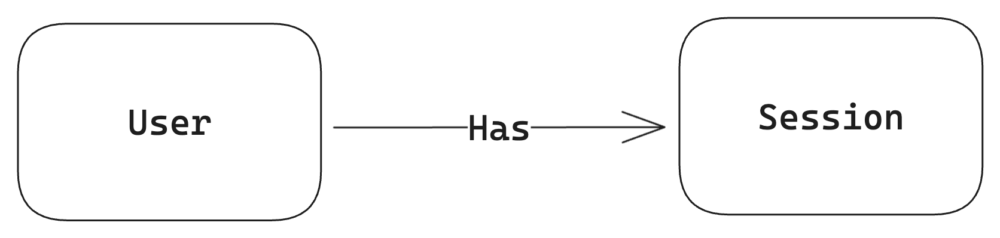

# DynamoDB Session Store

A simple session store implementation backed by a DynamoDB Table.

## Background

This is my personal interpretation of the example with the same name in [Alex DeBrie's DynamoDB Book](https://dynamodbbook.com/). My approach has a few differences from Alex's solution, but the overall functionality remains the same. Thus, the differences are not discussed in this repository.

## Table Design

### ERD

### Access Patterns

<table>
    <thead>
        <tr>
            <th>Entity</th>
            <th>Access Pattern</th>
            <th>API Endpoint</th>
            <th>Notes</th>
        </tr>
    </thead>
    <tbody>
        <tr>
            <td>User</td>
            <td>Get User Information</td>
            <td><code>N/A</code></td>
            <td>Used internally by the login endpoint to validate the credentials given</td>
        </tr>
        <tr>
            <td rowspan="3">Session</td>
            <td>Create Session</td>
            <td>POST /login</td>
            <td>Fails if the given credentials are invalid</td>
        </tr>
        <tr>
            <td>Time-Based Delete</td>
            <td><code>N/A</code></td>
            <td>
                Utilize DynamoDB TTL, with consistency checks on a dedicated 
                <code>TTL</code> attribute to account for deletion delays
            </td>
        </tr>
        <tr>
            <td>Manual Delete</td>
            <td>DELETE /users/{username}/sessions</td>
            <td></td>
        </tr>
    </tbody>
</table>
